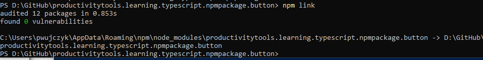
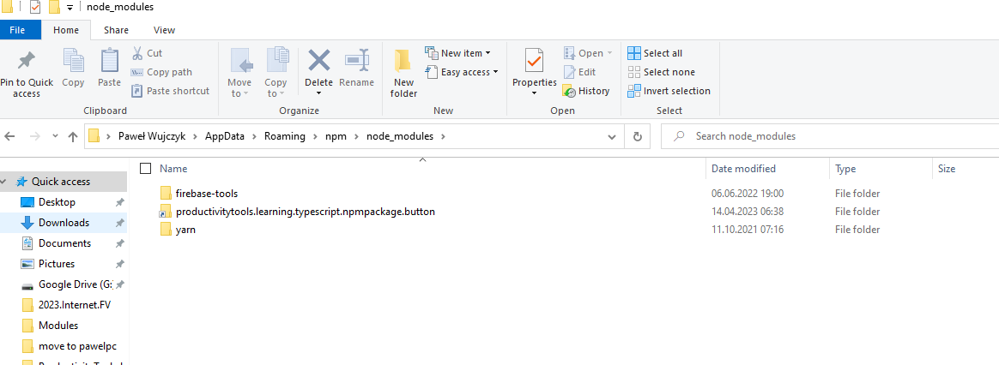
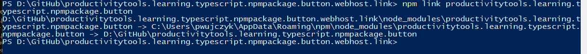
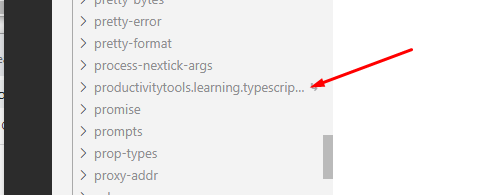

Learning how to use npm link

In the package directory ```npm link```



In the npm directory I have link to my project




## Host project

Need to be written in typescript. 

### Add typescript to CommonJS project

```
npm install --save typescript @types/node @types/react @types/react-dom @types/jest
npm install --save-dev @types/react @types/react-dom
```

Rename files to tsx

Add tsconfig.json
```
{
  "compilerOptions": {
    "target": "es5",
    "module": "commonjs",
    "jsx": "react",
    "outDir": "./dist",
    "strict": true,
    "esModuleInterop": true
  },
  "include": [
    "./src/**/*"
  ]
}
```


Without having the dependency already installed do 

```npm link```



This will create link in the **node_modules** to our package



but package won't be added to package.json. Still you will be able to use it.